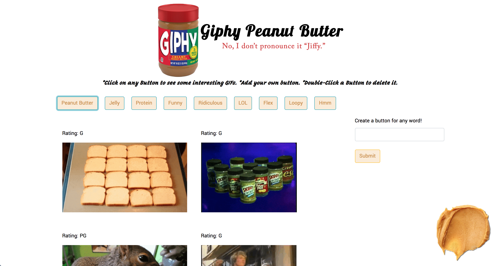

# Giphy

# "Giphy" Peanut Butter
No, I don't pronounce it "Jiffy."

### How It Works
By clicking on any of the pre-loaded buttons, it will load 10 of the .gif files from www.giphy.com based on that keyword. You can also type in a word of your own, which is create a new button. This button can be used the same as the pre-loaded ones. If you want to delete a button, simply double-click it.

### [Try it out!](https://ragobash.github.io/giphy/)

Technology:
HTML5 | CSS3 | JavaScript | jQuery
Bootstrap | Ajax | Giphy API